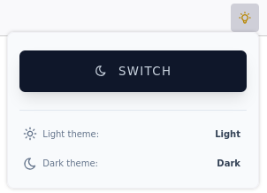
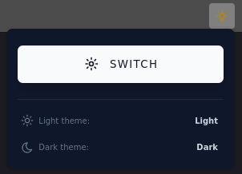

# Fast theme switcher

A simple firefox add-on that lets you quickly switch between themes. You can select your default light and dark theme and then switch between those with a simple click.

[Firefox Add-Ons - Fast Theme Switcher](https://addons.mozilla.org/de/firefox/addon/fast-theme-switcher/)





## Development

```sh
npm i

# start dev
npm start

# build zip
npm run build
```

## Credits

* Icons from [tabler/tabler-icons](https://github.com/tabler/tabler-icons)

## License

MIT